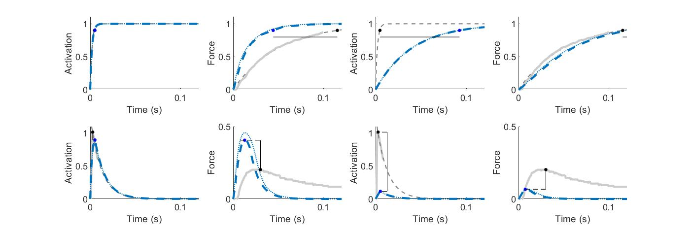
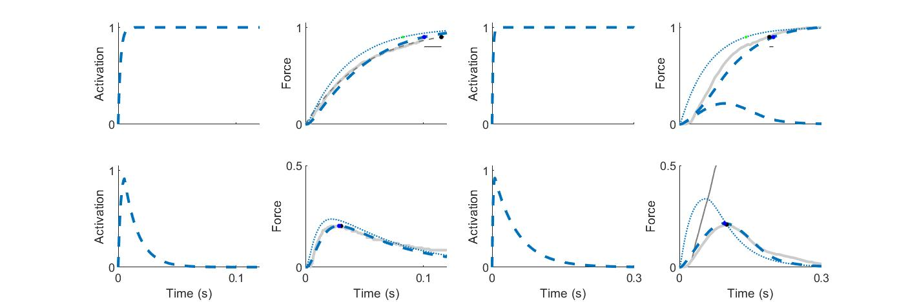
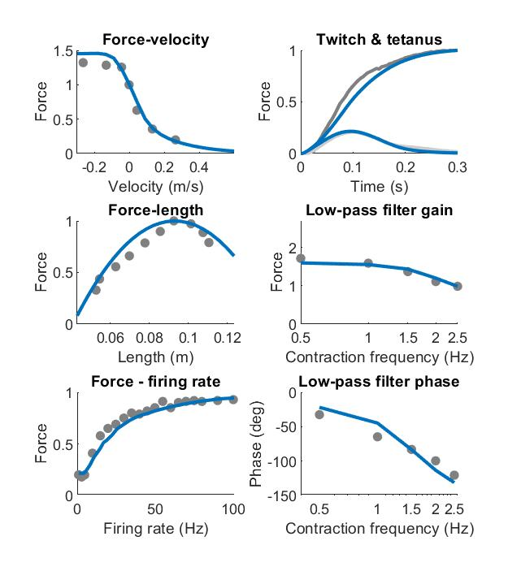

# CaFaXC muscle model
This repository contains code that describes the calcium-facilitation-cross-bridge-contraction (CaFaXC) muscle model. 
The model simulates muscle force development in response to various excitation inputs, alongside dependencies on muscle length and contraction velocity. 
The model is described in detail in [a BioRxiv preprint](https://www.biorxiv.org/content/10.1101/2024.08.07.606988v1). 
The repository also contains summary data that together with code can be used to reproduce the manuscript's main figures. 
## Running the model
To run the CaFaXC on various conditions, use the main.m script. Running the script results in saving model output in this folder: cafaxc-muscle-model\manuscript figures\model output.
This model output is subsequently used to create the manuscript figures (see: cafaxc-muscle-model\manuscript figures\code)
## Adjusting model parameters
Model parameters may be adjusted through scripts in this folder: cafaxc-muscle-model\model parameters
## Finding muscle excitations for cyclic force study
For the low-pass filter effect of muscle, we sought to find the muscle model excitations that yield the cyclic forces as observed in experiment.
Because the model is not invertable (i.e. excitation cannot be algebraically determined from force), we used CasADi optimal control to find the muscle excitations. 
The code can be found in this folder: cafaxc-muscle-model\cyclic force study. 
Note that you need to download [CasADi software](https://web.casadi.org/) to run these scripts. 
The obtained excitations are saved an used in the main.m script to simulate the cyclic force study. 
## Data
Data from several previous publications was used. We digitized figures using [an online digitization tool](https://apps.automeris.io/wpd/). 
These digitized data can be found in this folder: cafaxc-muscle-model\manuscript figures\data.
## Reproducing figures
To reproduce the manuscript figures, run the scripts in this folder: cafaxc-muscle-model\manuscript figures\code.
These figures are shown below. 
### Figure 4: Predictions from conventional muscle models vs. empirical data for temporal response behaviors of mouse muscle. 

Two definitions of model activation are considered here that differ in their activation dynamics time constant, which is either calcium-based from empirical, or force-based where it is tuned to yield good agreement with force development data. 
Two types of stimuli are applied: Step tetanus (top row) and single twitch (bottom row). (Left panels) The calcium-based definition results in fast muscle activation, but also in overestimation of rate of force development (73 - 79 ms shorter rise time) and twitch force amplitude (119-125% greater) for both Hill-type and cross-bridge (CB) models. 
(Right panels) The force-based definition results in slow force development, but also in underestimation of the rate of CaTrop activation (87 ms longer rise time), twitch force amplitude (65-68% smaller) and twitch CaTrop amplitude (87% smaller). 
Data are from mouse extensor digitorum longus muscle fiber bundles at 28 C [as previously reported](https://pubmed.ncbi.nlm.nih.gov/8923269/); all quantities are expressed as fraction of the maximal tetanic value. 
Model input was square-wave stimulation of indicated duration. 
Model parameters are the same for force-based vs. calcium-based definitions (see preprint for derivation and definitions), except for the activation time constant (τ_act= 35 ms vs. τ_act= 2 ms, respectively). 
Cross-bridge model cycling rates (constrained to agree with force-velocity, see preprint): f_1= 275 s-1, g_1= 275 s-1, g_2= 1600 s-1, g_3= 175 s-1.

### Figure 5: Predictions from conventional muscle models vs. empirical data for temporal response of human quadriceps.

Two definitions of activation are compared: (left panels) calcium-based (CaTrop) and (right panels) force-based. 
Two types of stimuli are applied: Step tetanus (top row) and single twitch (bottom row). Simulation of model activation is shown, but no CaTrop data were available. 
(Left panels) Calcium-based activation results in overestimation of both rate (90 ms shorter rise time) and amplitude (70-89% greater) of twitch force development. 
(Right panels) Force-based definition results in slow force development that can be fitted well to data, but also in underestimation of twitch force amplitude (80-85% smaller). 
Data are from human quadriceps muscle in vivo [as previously reported](https://pubmed.ncbi.nlm.nih.gov/18756009/); all quantities are expressed as fraction of the maximal tetanic value. 
Model input was square-wave stimulation of indicated duration. 
All model parameters are the same for force-based vs. calcium-based definitions (see preprint for derivation and definitions), except for the activation time constant (τ_act= 60 ms vs. τ_act = 2 ms, respectively). 
Cross-bridge model cycling rates: f_1= 150 s-1, g_1= 150 s-1, g_2= 1200 s-1, g_3= 100 s-1.

### Figure 7: Proposed model predictions vs. empirical data for temporal response behaviors of human quadriceps and mouse fast-twitch muscle

Proposed model produces realistic force development in mouse (left panels) and human muscle (right panels) and mouse muscle. 
Two types of stimuli are applied: Step tetanus (top row) and single twitch (bottom row).
Model produces slow tetanic force development in human (4 ms longer rise time than empirical) and mouse (13 ms shorter rise time than empirical). 
For mouse muscle, predictions of activation match empirical estimates in both twitch and tetanus. As there is no data of human muscle activation, activation is only shown for model.
Model twitch amplitude matches empirical force amplitude in human (1% smaller than empirical) and mouse (3% smaller than empirical). 
Data are from human quadriceps muscle in vivo (right panels) and from mouse extensor digitorum longus muscle fiber bundles at 28 C (left panels). 
Ca2+ activation is defined as the fraction of Ca2+ bound to troponin; all quantities are expressed as fraction of the maximal tetanic value. 
Model input was square-wave stimulation of indicated duration. 
Mouse parameter values: τ_act= 2 ms, τ_deact = 12 ms, τ_fac= 35 ms, τ_def = 60 ms, f_1= 275 s-1, g_1= 275 s-1, g_2= 1600 s-1, g_3= 175 s-1. 
Human parameter values: τ_act= 2 ms, τ_deact = 50 ms, τ_fac= 60 ms, τ_def = 20 ms, f_1= 150 s-1, g_1= 150 s-1, g_2= 1200 s-1, g_3= 100 s-1 (see preprint for derivation and definitions).

### Figure 8: Proposed integrated muscle model predicts six muscle behaviors of human quadriceps

Steady force-length and force-velocity responses of muscle contractile element, explained by proposed model (R2 = 0.85 and R2 = 0.98).
Temporal twitch and tetanus responses of muscle, predicted well by proposed model (R2 = 0.96 and R2 = 0.99). 
Frequency responses of muscle, including force – firing rate and low-pass filter effect. 
Force-firing rate: force increases with stimulate rate, approximately captured by proposed model (R2 = 0.95). 
Low-pass filter effect: Force gain, quantified as the amount of force per unit electromyography (EMG), decreases with cyclic contraction frequency, captured by proposed model (R2 = 0.88). 
The force phase, quantified as phase delay between EMG and force, increases in magnitude with cyclic contraction frequency, captured by proposed model (R2 = 0.88). 
All data are for human quadriceps in vivo (see preprint).
Parameter values: τ_act= 2 ms, τ_deact = 50 ms, τ_fac= 60 ms, τ_def = 20 ms,  f_1= 150 s-1, g_1= 150 s-1, g_2= 1200 s-1, g_3= 100 s-1 (see preprint for derivation and definitions). 
Lacking data from individual participants for some conditions, all reported R2 values are with respect to the participant average. 
